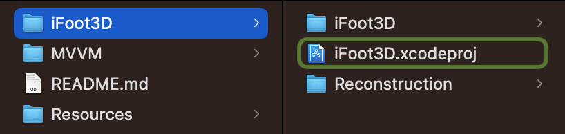
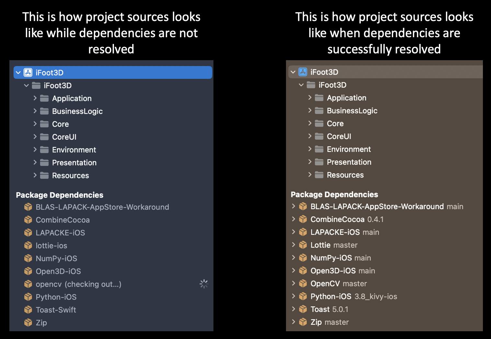
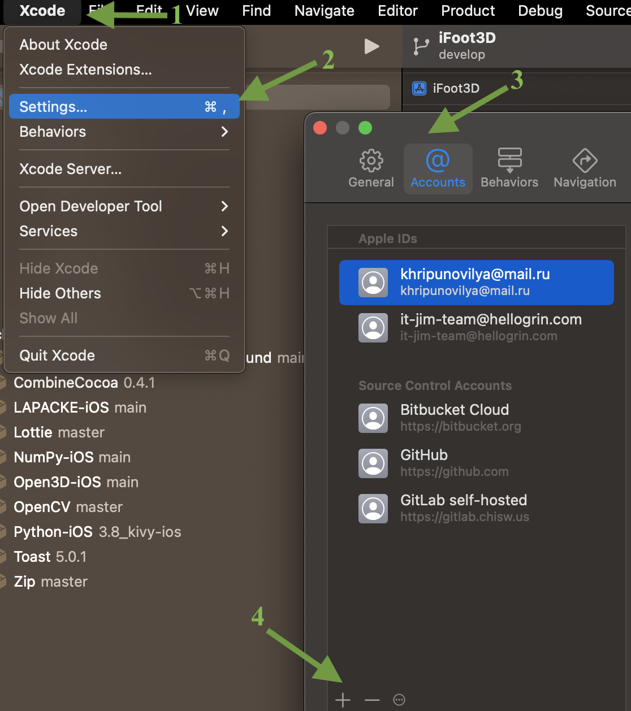
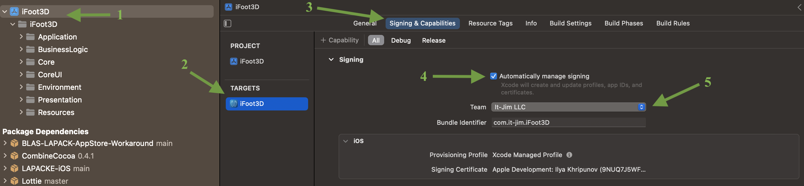
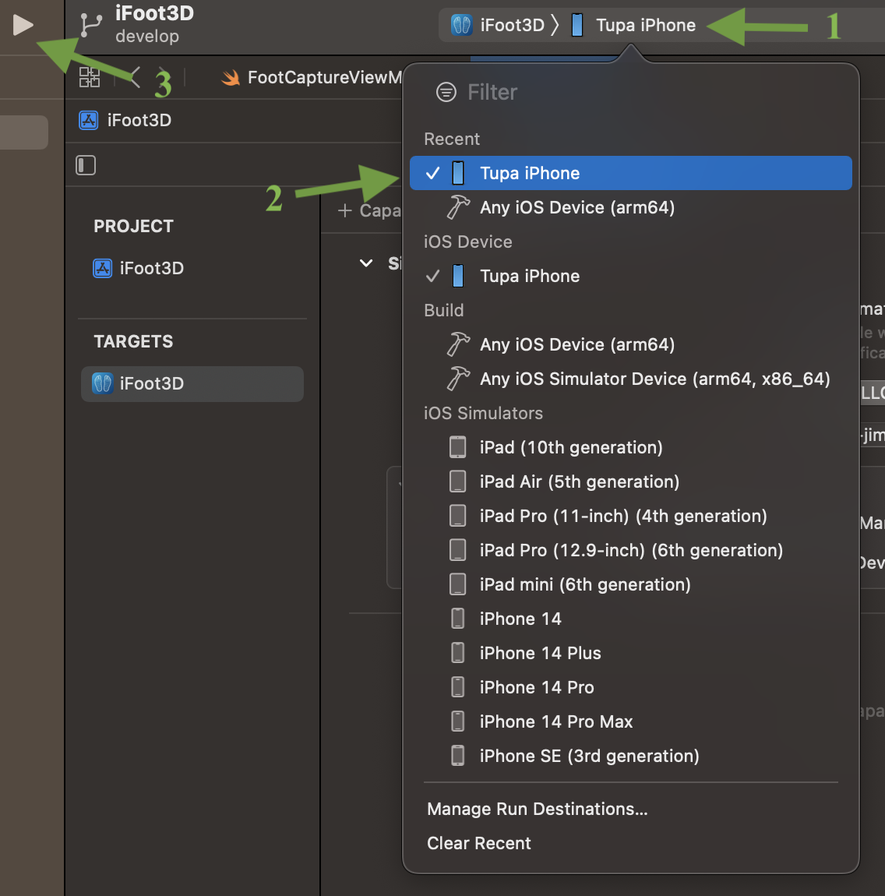

# iFoot3D #

**Powered By: It-Jim**

## Description ##

The application gives ability to scan foot and get 3D model of it. In order to do that user needs to capture several photos of his/her foot. After that the images will be processed and converted into 3D model which has real size and shape. Final foot model can be exported and used for further processing.

## Installation ##

### Integrated Development Environment ###

First of all in order to launch sources of the app you need to have MacOSX device with Big Sur or newer. After that you need to install Xcode IDE 14.1 or newer. In order to install updates for the system, you can open Settings app on device and follow instructions there. If you need to install Xcode, then use [Xcode Release](https://xcodereleases.com) website and download latest version. You can also install the IDE from AppStore, however, it will take much more time.

### Project setup ###

After you have successfully installed Xcode, clone the repository from the repo or download it. When sources are succefully downloaded, open folder **iFoot**. Inside the folder select **iFoot3D.xcodeproj**, double click on it and the project will be opened inside xcode.

When the project is succefully opened inside Xcode, wait untill all dependencies are resolved and project indexing finished. 

If there are any troubles during dependencies resolution, then try to clean up [Xcode Derived Data](https://www.swiftanytime.com/blog/how-to-delete-derived-data-in-xcode). After completing steps from tutorial, open project and wait untill all dependencies resolved and project indexing finished.

### Run ###

Unfortunatelly, you won't be able to launch the app using iOS Simulators, cause the app uses AR session and needs access to device's camera. That's why the only possible way to run the app, is to install it to device. In order to do that inside Xcode and launch the app in debug mode, follow next instructions.

At first you need to authorize with your **Apple Id** inside Xcode. In order to do that do next:

1. Press **Xcode** at the top of screen
2. Select **Settings**
3. Select **Accounts** tab 
4. Press **+** at the bottom left corner of settings window
5. Select **Apple Id** option and press **Continue**
6. Authorize using your Apple Id credentials

Next step is updating **Signing & Capabilities** information of the app. Detailed instruction on how to do that, you can find underneath.

1. Select project file.
2. Select **IFoot3D** target in the left menu
3. Select **Signing & Capabilities** tab.
4. Select **Automatically manage signing** checkbox if it is not checked.
5. Select specific team inside **Team** dropdown.

After this the project is ready to be launched straightly on device. For that, connect your iOS device to mac and select it from device's dropdown. After you have selected the device, which is required, then press launch button and wait, untill the app will be installed and run.

## Requirements

| Platform | Minimum Swift Version |
| --- | --- |
| iOS 14.0+| 5.7 |
